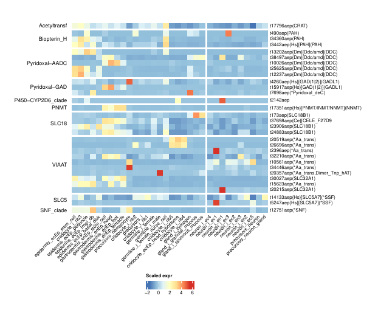
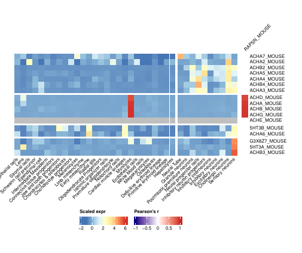
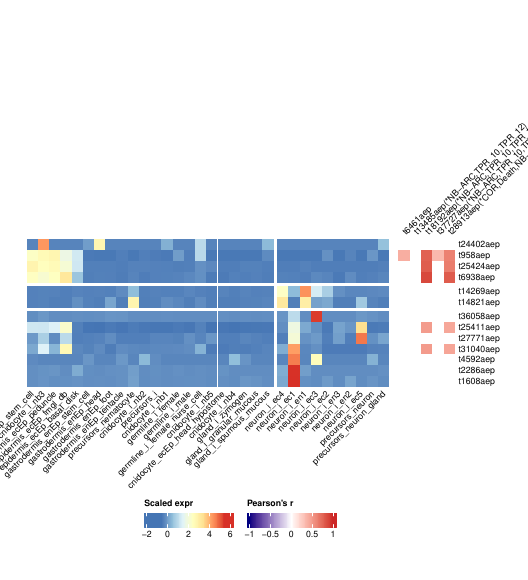
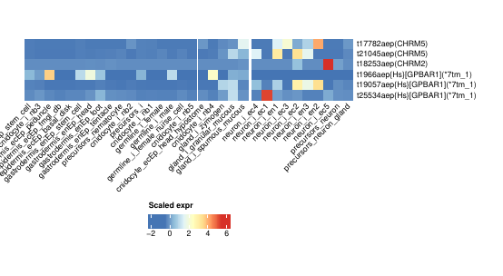
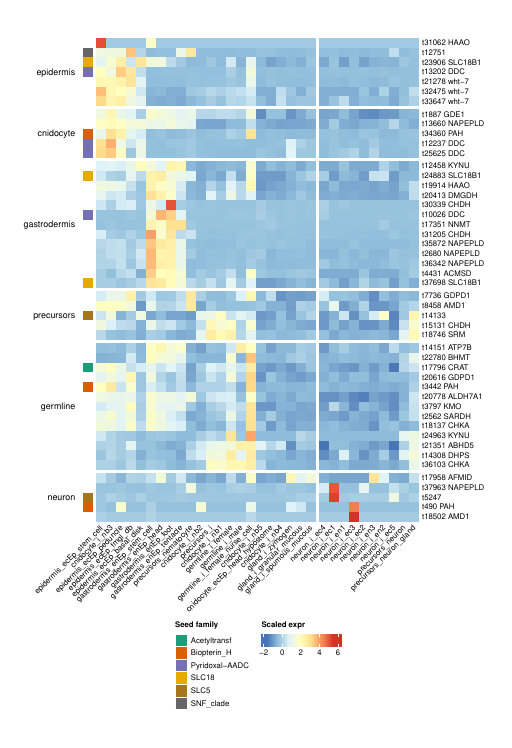
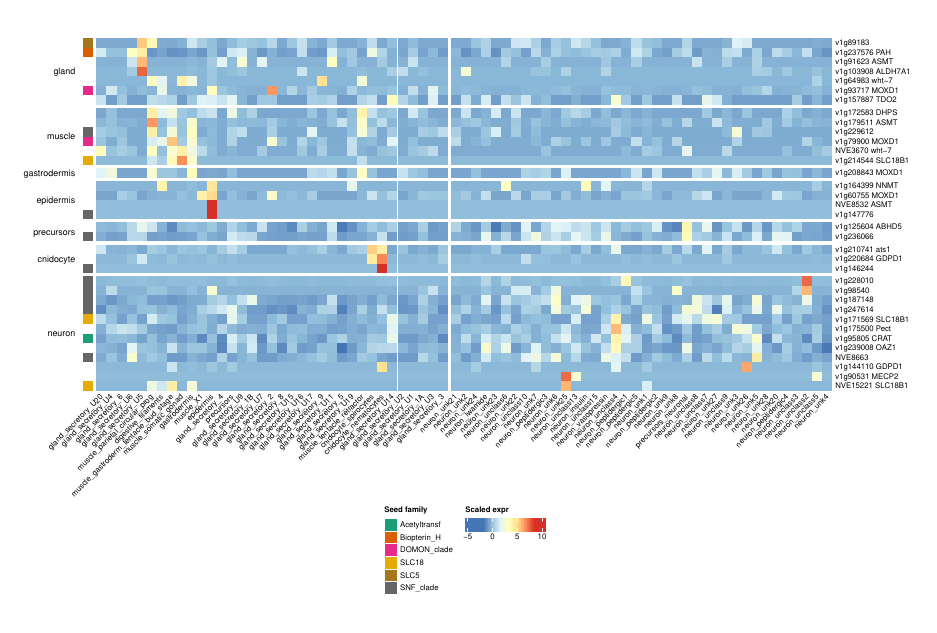
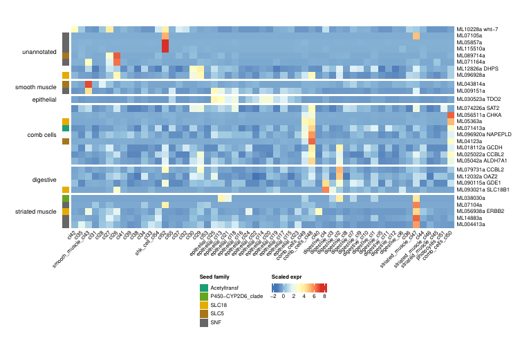
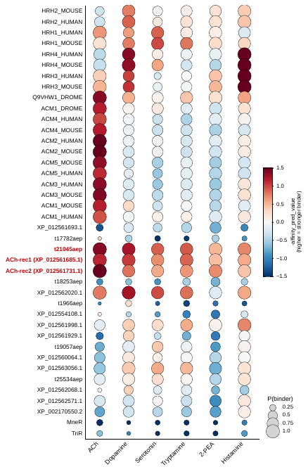
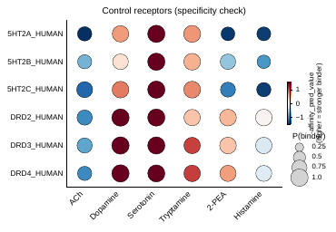

# Analysis walkthrough

**From promiscuity to specialization: the origin of biogenic amine signaling is pre-bilaterian**
Pittis, Yañez-Guerra, Ruperti, Musser, Cole, Marinković, Thiel, Huerta-Cepas, Technau, Jékely, Arendt

The paper asks whether the machinery that makes, packages and receives acetylcholine and monoamines predates bilaterian animals. The computational evidence comes from four analyses: gene-family phylogenies (who has which enzyme, transporter or receptor), single-cell expression (where those genes are expressed and which genes are co-expressed with them), and structure-based binding predictions for candidate cnidarian receptors. Metabolomics and immunohistochemistry (Figs 1, 6) are experimental and not part of this repository.

| Analysis | Figures | Code |
|---|---|---|
| [Gene-family phylogenies](#1-gene-family-phylogenies) | 2, 3, 4A–B, 5A–B, S1–S2 | `scripts/phylogeny_pipeline.sh`, `python/phylogenies/` |
| [Cell-type expression matrices](#2-cell-type-expression-matrices) | all expression panels | `R/matrices.R`, `scripts/01_build_matrices.R` |
| [Gene-family expression heatmaps](#3-gene-family-expression-heatmaps) | 4D–E, 5C–D, 7, S4–S10 | `R/heatmaps.R`, `scripts/04_plot_family_heatmaps.R` |
| [Amine-metabolism coregulons](#4-amine-metabolism-coregulons) | 8A–C, S11–S13 | `R/coregulons.R`, `scripts/02_compute_coregulons.R`, `scripts/03_plot_coregulons.R` |
| [Boltz-2 binding predictions](#5-boltz-2-binding-predictions) | 4B, S14; Table S4 | `python/boltz/` |

See also: [Data](#data) · [Reproduce](#reproduce) · [Data deposits](#data-deposits)

## Data

Protein datasets of 68 eukaryotic species (Table S2) plus UniProt prokaryotic reference proteomes; six public single-cell atlases; eggNOG-mapper v2.1.7 functional annotations; Boltz-2 predictions computed for this study. Download instructions: [`data/README.md`](../data/README.md).

| Species | Single-cell atlas | Cell types used | n |
|---|---|---|--:|
| *Mus musculus* | Cao et al. 2019 (organogenesis) | main cell types | 37 |
| *Drosophila melanogaster* | Fly Cell Atlas, 10x body | fine annotation (artefacts removed) | 33 |
| *Hydra vulgaris* | Siebert et al. 2019 UMI matrix | cell types of Levy et al. 2021 | 32 |
| *Nematostella vectensis* | adult MARS-seq atlas | cell types of Levy et al. 2021 | 73 |
| *Mnemiopsis leidyi* | Sebé-Pedrós et al. 2018 | metacell annotation | 55 |
| *Spongilla lacustris* | Musser et al. 2021 | cell types of Table 1 | 23 |

## 1. Gene-family phylogenies

*Figs 2–5, S1–S2 · Table S5*

For each gene involved in biosynthesis, vesicular transport, reuptake or reception of a transmitter, the Pfam family of its product was searched across all proteomes. Presence, absence and orthology of the bilaterian specialists (ChAT, TH, TPH, VAChT, VMAT, mAChRs, nAChR subunits) are read from these trees.

### Workflow

1. **Homolog search**: `hmmsearch --cut_ga` (HMMER 3.3.2) against eukaryotic and prokaryotic proteomes; above 300 prokaryotic hits, at most 100 per bacterial or archaeal phylum were kept.
2. **Superfamilies** (MFS, rhodopsin GPCRs): all-vs-all BLASTP (E ≤ 1e-5), MCL clustering (inflation 1.4 and 6.0); the clusters containing the families of interest were analysed (SLC18 = MFS cluster 0005, SLC22 = cluster 0001; GPCR-A cluster 0002).
3. **Family tree**: alignment method chosen case by case (MAFFT L-INS-i/E-INS-i/FFT-NS-2 or Clustal Omega), gappy columns removed (>90% or, for large sets, >99% gaps), tree with FastTree (`-lg`) or, for smaller families, IQ-TREE.
4. **Clade of interest**: extracted from the family tree, re-aligned (L-INS-i/E-INS-i), recomputed with IQ-TREE 1.6.12 (ModelFinder over LG models, ultrafast bootstrap).

```bash
# family tree (large set)
clustalo -i family.fasta -o family.clustalo
python python/phylogenies/filter_gappy_columns.py family.clustalo 0.99 > family.clustalo.gt001
FastTree -lg family.clustalo.gt001 > family.clustalo.gt001.fasttree

# clade of interest
linsi clade.fasta > clade.linsi
python python/phylogenies/filter_gappy_columns.py clade.linsi 0.9 > clade.linsi.gt01
iqtree -s clade.linsi.gt01 -m MFP -mset LG -bb 1000 -nt AUTO
```

### Trees and alignments (Table S5)

Every tree was linked to its alignment by content (identical sequence sets) and to its IQ-TREE report; sequence counts equal tree leaves in all cases. Files are deposited under the numbered names below.

| ID | Fig. | Family | Tree | Seqs | Columns | Alignment, gap filter | Tree method | Model |
|---|---|---|---|--:|--:|---|---|---|
| 01 | 2B | carnitine acyltransferases | family | 506 | 867 | L-INS-i, >90% | IQ-TREE | LG+F+R9 |
| 02 | 2B, S2 | carnitine acyltransferases | ChAT/CrAT clade | 169 | 1590 | L-INS-i, >90% | IQ-TREE | LG+F+R7 |
| 03 | 2C | biopterin hydroxylases | family | 559 | 5386 | FFT-NS-2, none | FastTree | LG |
| 04 | 2C | biopterin hydroxylases | AAAH clade | 179 | 538 | L-INS-i, >90% | IQ-TREE | LG+R7 |
| 05 | 2D | PLP decarboxylases | family | 2195 | 9530 | FFT-NS-2, none | FastTree | LG |
| 06 | 2D | PLP decarboxylases | AADC clade | 194 | 583 | L-INS-i, >90% | IQ-TREE | LG+R8 |
| 07 | 2D | PLP decarboxylases | GAD clade | 373 | 2068 | L-INS-i, >90% | IQ-TREE | LG+R10 |
| 08 | 2E | DOMON monooxygenases | family | 670 | 5609 | L-INS-i, >90% | IQ-TREE | LG+R9 |
| 09 | 2E | DOMON monooxygenases | DBH/MOXD clade | 236 | 3394 | L-INS-i, >90% | IQ-TREE | LG+R8 |
| 10 | 3A | MFS superfamily | family | 8784 | 1130 | FFT-NS-2, >90% | FastTree | LG |
| 11 | 3A | MFS superfamily | SLC18 (cluster 0005) | 404 | 662 | L-INS-i, >90% | IQ-TREE | LG+F+R9 |
| 12 | 3A | MFS superfamily | SLC22 (cluster 0001) | 1441 | 890 | Clustal Omega, >90% | FastTree | LG |
| 13 | 3A | MFS superfamily | SLC22 subset | 440 | 756 | E-INS-i, >90% | IQ-TREE | LG+F+R8 |
| 14 | 3B | SSF transporters | family | 5704 | 17894 | FFT-NS-2, none | FastTree | LG |
| 15 | 3B | SSF transporters | ChT clade | 221 | 628 | L-INS-i, >90% | IQ-TREE | LG+R9 |
| 16 | 4A | rhodopsin GPCRs | MCL cluster 0002 | 3173 | 607 | FFT-NS-2, >90% | FastTree | LG |
| 17 | 4A | rhodopsin GPCRs | 4–10 TM filtered | 2657 | 3271 | Clustal Omega, >99% | FastTree | LG |
| 18 | 4A | rhodopsin GPCRs | H-ACh-monoamine clade¹ | 1092 | 2650 | Clustal Omega, >99% | IQ-TREE | LG+F+R10 |
| 19 | 5A | Cys-loop LGICs | family | 2538 | 840 | Clustal Omega, >90% | FastTree | LG |
| 20 | 5B | Cys-loop LGICs | cationic clade subset | 212 | 593 | E-INS-i, >90% | IQ-TREE | LG+F+R10 |
| 21 | S1A | NNMT/PNMT/TEMT | family | 290 | 1224 | L-INS-i, >90% | IQ-TREE | LG+R7 |
| 22 | S1B | cytochrome P450 | family | 4935 | 3097 | Clustal Omega, >99% | FastTree | LG |
| 23 | S1B | cytochrome P450 | CYP2 clade subset | 131 | 540 | E-INS-i, >90% | IQ-TREE | LG+F+R6 |

¹ Fig. 4B is a species-trimmed schematic of its mAChR subclade.

The complete table, including original and deposited file names, is [`data/phylogenies/Table_S5.phylogenies.tsv`](../data/phylogenies/Table_S5.phylogenies.tsv); the deposit is built by `python/phylogenies/build_deposit.py`.

> **Reading the trees.** Broad-specificity family members (CrAT, PAH, AADC, MOXD-like monooxygenases, VPAT, SLC22) are present across non-bilaterian animals, whereas the substrate-specific enzymes and transporters (ChAT, TH, TPH, DBH/TBH, VAChT/VMAT) arise by duplication within Bilateria. mAChR orthologs are found in medusozoan cnidarians; nAChR subunits in both cnidarian lineages.

## 2. Cell-type expression matrices

For every atlas, UMI counts are summed per annotated cell type and divided by the number of cells of that type. The same six matrices feed every expression figure and the coregulon analysis; rebuilt from the public data they are identical to the ones used for the figures.

```r
cell_type_means <- function(mat, cell_types) {
  cls <- c_factor(cell_types)                      # locale-independent level order
  normalise_by_clusters(aggregate_cols(mat, cls), cls)
}
```

## 3. Gene-family expression heatmaps

*Figs 4D–E, 5C–D, 7, S4–S10*

Rows are the curated members of a family (`data/families/`), scaled across cell types. All heatmaps of a species share one column order: complete-linkage clustering on 1 − Pearson r of the whole transcriptome, with neuronal cell types moved to a right-hand block. Hand-curated phylogeny row orders used in Figs 5C, 5D and S4 are stored in `data/families/row_orders/`. Figs 5C–D add the Pearson correlation (p ≤ 0.05) of each nAChR subunit with Rapsyn-related genes.

```r
cell_type_order <- function(mat) {
  hc <- hclust(as.dist(1 - cor(as.matrix(mat))), method = "complete")
  o  <- labels(rev(as.dendrogram(hc)))
  c(o[neuron_split(o) == "O"], o[neuron_split(o) == "N"])   # neurons on the right
}
```

| | |
|---|---|
| <br>**Fig. 7B** — *Hydra* biosynthesis enzymes and transporters. | <br>**Fig. 5C** — muscle-type subunits (δ, α1, β1, γ) are myocyte-specific and correlate with Rapsyn. |
| <br>**Fig. 5D** — *Hydra* subunits expressed in epidermal (muscle) cell types correlate with Rapsyn-related genes. | <br>**Fig. 4E** — *Hydra* mAChR-clade receptors are mostly neuronal. |

## 4. Amine-metabolism coregulons

*Figs 8A–C, S11–S13*

Which genes are co-expressed, across cell types, with the enzymes and transporters of amine metabolism? Seeds are the members of eight families (Acetyltransf, Biopterin_H, Pyridoxal-AADC, DOMON, P450-CYP2D6, SLC18, SLC5, SNF).

### Criterion

> For each seed, Pearson r and a two-tailed p-value are computed against every expressed gene; p-values are Benjamini–Hochberg-adjusted per seed within the candidate pool (GO:0009308 "amine metabolic process" genes plus seeds). A gene joins when **r ≥ 0.5** and **adjusted p ≤ 0.05** for a seed that has at least one non-self partner. Thresholds live in `config.yml`.

```r
pass <- (r >= cc$r_min) & (padj <= cc$padj_max)
active <- Filter(function(s) sum(pass[setdiff(rownames(pass), s), s]) >= 1,
                 intersect(colnames(pass), rownames(pass)))
members <- union(intersect(rownames(r)[rowSums(pass[, active, drop = FALSE]) >= 1], go_ids), active)
```

In the heatmaps, genes are grouped by the cell-type class in which their expression peaks (white gaps) and clustered within each group; the left bar marks seed genes by family.

### Results

| Species | Cell types | Seeds (active) | Genes | Figure |
|---|--:|--:|--:|---|
| *Hydra* | 32 | 18 (14) | 48 | 8A |
| *Nematostella* | 73 | 37 (17) | 35 | 8B |
| *Mnemiopsis* | 55 | 27 (17) | 29 | 8C |
| *Spongilla* | 23 | 20 (13) | 32 | S11 |
| Mouse | 37 | 78 (54) | 100 | S12 |
| *Drosophila* | 33 | 31 (26) | 48 | S13 |

**Interpretation.** Beyond the expected core (AADC and PAH paralogs, CRAT, choline-handling enzymes, SLC18B1/VPAT, white/ABCG transporters), the coregulons recover the kynurenine pathway (most completely in *Spongilla*), NAPE-PLD/GDPD1/GDE1 in *Hydra*, ASMT paralogs in *Nematostella* and an expanded MOXD1 repertoire in *Spongilla*, which lacks neurons. In the bilaterians, the same neighbourhoods are occupied by the substrate-specific duplicates (TPH1, NET, VMAT1 in mouse; Tβh, Tdc2, Trh, ChAT, VAChT in *Drosophila*).

| | | |
|---|---|---|
| <br>**Fig. 8A** — *Hydra* | <br>**Fig. 8B** — *Nematostella* | <br>**Fig. 8C** — *Mnemiopsis* |

## 5. Boltz-2 binding predictions

*Fig. 4B, S14 · Table S4*

46 receptors — bilaterian muscarinic, histamine, serotonin and dopamine receptors of known specificity, *Hydra* mAChR-clade receptors, and a ctenophore and a placozoan receptor — were each predicted in complex with acetylcholine, dopamine, serotonin, tryptamine, 2-phenylethylamine and histamine (Boltz 2.2.1, default settings, MSAs from the ColabFold server). Affinity and binder probability are the means of the two affinity heads.

```bash
python python/boltz/extract_affinities.py Output/ --inputs Input/YAMLs > data/boltz2/boltz_predictions_full.csv
python python/boltz/make_table.py data/boltz2/boltz_predictions_full.csv results/tables/Table_S4_boltz2_predictions.xlsx
python python/boltz/plot_panels.py
```

| Receptors | Top-ranked ligand | P(binder), top ligand |
|---|---|--:|
| Human, mouse and fly mAChRs | acetylcholine | 0.983–0.998 |
| HRH2–4 (human, mouse) | histamine | 0.905–0.990 |
| 5HT2A–C / DRD2–4 | serotonin / dopamine | 0.993–0.998 |
| *Hydra* ACh-rec1, ACh-rec2, t21045aep (conserved orthosteric site) | acetylcholine | 0.997–0.998 |
| *Hydra* receptors with orthosteric substitutions | mixed | ACh 0.55–0.74 |
| MneR (ctenophore), TriR (placozoan) | none | ≤ 0.23 |

**Interpretation.** The controls recover their known ligands (HRH1 is the exception), which supports reading the *Hydra* predictions: the two receptors with a fully conserved orthosteric site, and the matching transcript, are predicted to bind acetylcholine as strongly as bilaterian mAChRs, while receptors with pocket substitutions are not.

| | |
|---|---|
| <br>**Fig. 4B** (right) — dot size: binder probability; colour: −affinity_pred_value. | <br>**Fig. S14** — serotonin and dopamine receptor controls. |

## Reproduce

```bash
git clone https://github.com/alxndrsPittis/neurotransevo.git && cd neurotransevo
conda env create -f environment.yml && conda activate neurotransevo
cp config.local.yml.example config.local.yml     # point to the downloaded data
make all                                         # matrices → coregulons → figures → tables
```

Paths are read from `config.yml`, overridden by `config.local.yml` or `NEUROTRANSEVO_<KEY>` environment variables. A full run from the raw data takes about 7 minutes on a workstation. Figures are written as SVG and PDF with editable text.

## Data deposits

| Archive | Content |
|---|---|
| `neurotransevo_phylogenies.zip` (18 MB) | 23 alignments and trees behind Figs 2–5 and S1–S2, numbered as in Table S5, with IQ-TREE reports |
| `neurotransevo_singlecell_annotations.zip` (50 MB) | eggNOG-mapper annotations, curated gene families, cell-type-averaged expression matrices and coregulon tables; unpack into `data/` to run the pipeline without rebuilding matrices |
| `neurotransevo_boltz2_predictions.zip` (507 MB) | Boltz-2 inputs, per-receptor MSAs, predicted structures, affinity and confidence files for all 276 predictions (Table S4) |
